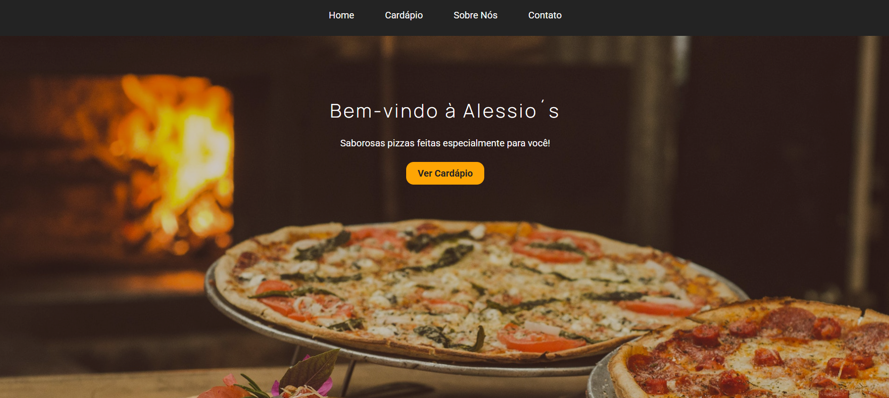

# 🍕 Alessio's Pizza

Uma landing page comercial moderna, elegante e totalmente responsiva desenvolvida para uma pizzaria fictícia. 
O projeto foi criado durante a **Trilha Fullstack JavaScript da Onebitcode** como forma de praticar e consolidar conceitos de **HTML5 Semântico**,
**CSS3 Avançado** e **Design Responsivo**.

---

## Prévia do Projeto

---

## Tecnologias e Conceitos Utilizados

HTML5:
- Estruturação semântica completa.
- Navegação interna suave com links ancorados (`#home`, `#menu`, `#about`, `#contact`).
- Formatação de links funcionais para e-mail (`mailto:`) e integração direta para pedidos via WhatsApp.
- Ícone SVG inline integrado no rodapé.

CSS3:
- **Metodologia BEM (Block Element Modifier):** Nomenclatura organizada de classes.
- **Navegação Suave:** Implementação da propriedade `scroll-behavior: smooth`.
- **Animações & Interatividade:** Efeitos de `transition` e `hover` nos botões de chamada para ação (CTA).
- **Variáveis CSS (`:root`):** Centralização da paleta de cores para fácil manutenção.
- **Design Responsivo:** Media queries (`@media (max-width: 768px)`) ajustando espaçamentos, tamanhos de fonte e alinhamentos para telas menores.

---

## Como Acessar

**[Clique aqui para ver a página rodando ao vivo](https://esdrasioseph.github.io/site-pizzaria/)**

---

## Autor

Desenvolvido por **Esdras Ioseph**  
Estudante de Análise e Desenvolvimento de Sistemas 
- GitHub: [@esdrasioseph](https://github.com/esdrasioseph)
